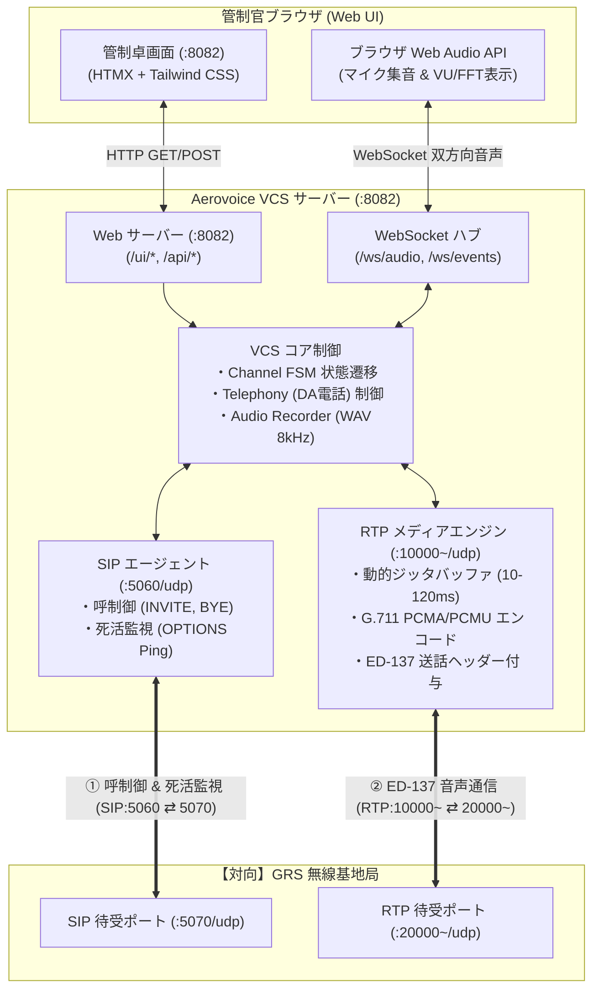
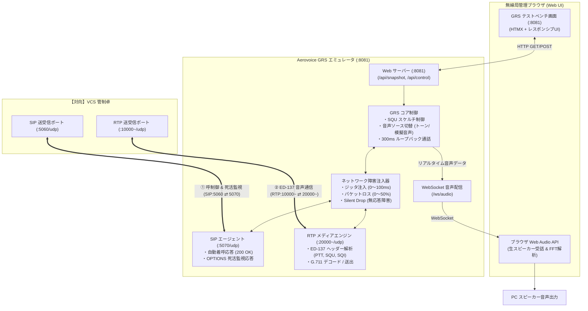

# Aerovoice - EUROCAE ED-137C Radio & Telephony Verification Suite

[English](README.md) | [日本語](README.ja.md)

> [!NOTE]
> **本ソフトウェアの目的と位置づけ**:
> Aerovoice は、航空管制音声通信規格 **EUROCAE ED-137C**（主に Volume 1 Radio, Volume 2 Telephone, Volume 4 Recording, Volume 5 Supervision）の検証・学習・相互接続試験を目的とした**オープンソースのプロトタイプ実装**です。
> 第三者認証機関による型式証明や公的認証を受けた製品ではなく、規格書の本文・図表の転載は含みません。

---

## ✈️ 概要 (Overview)

Aerovoice は、管制卓（VCS: Voice Communication System）コンソールと、対向の地上無線局（GRS: Ground Radio Station）シミュレータを完全なピュアGo（`CGO_ENABLED=0`）で提供する統合テストベンチです。
外部の専用ハードウェアや CGO/C ライブラリに依存せず、**Windows および macOS（Apple Silicon / Intel）** の双方で即座にビルド・実行可能です。英語・日本語の多言語UI（i18n）および標準航空英語テスト音声をサポートしています。

ブラウザを2画面開くだけで、VCS側（`http://127.0.0.1:8082`）とGRS側（`http://127.0.0.1:8081`）の間で、PTT送話、地上局受話、スケルチ（SQU）送出、電話短縮発信、1kHz試験トーン、300msエコーバック、リアルタイムFFTスペクトラムによる音声品質確認、パケットキャプチャ（PCAP）の事後診断までを一気通貫で検証できます。

また、多層E2Eテスト結果は自動的に [GitHub Pages](https://sh0jitmy.github.io/aerovoice/) に公開（英語・日本語両対応）されます。

---

## 🚀 主な機能 (Key Features)

### 1. Radio (ED-137C Volume 1 相当)
- **SIP/SDP 呼制御**: RFC 4566 / RFC 3261 に準拠したセッション確立（`a=ptime:10`, `a=ptime:20` 両対応、G.711 A-law / μ-law ネゴシエーション）。
- **ED-137 RTP ヘッダ拡張**: Profile `0x0167` による PTT Type（Normal / Priority / Emergency）、PTT-ID、Downlink Squelch（SQU）、Signal Quality Index（SQI 0〜100）の完全送受信。
- **Web Audio API & リアルタイム FFT スペクトラム**: マイク入力（ブラウザ標準）および受信音声を 8kHz でサンプリングし、Canvas 上に 60FPS のリアルタイムオーディオスペクトラム（0〜4kHz）と VU メーターを描画。英語航空テスト音声（"Radio check, radio check..."）および日本語テスト音声（「テスト、テスト。本日は晴天なり...」）の豊かな声帯フォルマントを可視化。
- **安全な完全無音化 (Audio ON / OFF)**: Audio OFF 時に Web Audio ハードウェア（AudioContext）を完全解放し、マイク入力トラックを物理停止してノイズや暗騒音のスピーカー漏れを完全ゼロ化（Complete Disable）。
- **動的ジッタバッファ & スケジューリング再生**: 受信パケットの重なり・音割れを解消する正確なキュー再生と、UI のスライダーによる 10ms 〜 120ms のジッタバッファ動的調整。

### 2. Telephony (ED-137C Volume 2 相当)
- **Direct Access (DA) 短縮通話**: 管制卓間のダイレクト通話をワンクリックで発信・着信（Full-Duplex）。
- **多言語音声通話試験**: 英語（"This is an ED-137 telephone quality test..."）および日本語（「テスト、テスト。本日は晴天なり...」）による明瞭な通話品質評価。
- **1kHz 試験トーン通話**: 1000Hz 純粋正弦波による回線疎通・音響歪み検証。
- **300ms エコーバック通話**: 受信した音声を 300ms 遅延させて折り返すループバック通話による受話確認。

### 3. Recordings (ED-137C Volume 4 相当)
- **自動 WAV ロギング**: PTT 送信時、SQU 受信時、電話通話時に自動で 8kHz 16-bit Linear PCM WAV ファイルを生成・カタログ化。
- **ブラウザインライン再生**: 録音タブからワンクリックで再生およびダウンロード可能。

### 4. Supervision (ED-137C Volume 5 相当)
- **SIP OPTIONS 死活監視**: GRS ノードに対してバックグラウンドで OPTIONS リクエストを定期送出し、RTT（往復遅延）とオンライン/オフライン状態をリアルタイム表示。

### 5. PCAP 事後診断エンジン (Post-Mortem Analysis)
- **ピュア Go PCAP パーサー**: `pcapgo` を用いた CGO/外部ライブラリ非依存の PCAP/PCAPNG 解析。
- **VoIP コール & ED-137 抽出**: パケットごとの PTT/SQU/SQI/ジッタ推移タイムラインを可視化。
- **音声復元**: PCAP 内の RTP ペイロードから音声を自動復元し、ブラウザ上で即座に再生可能。

### 6. GRS シミュレータ・テストベンチ (`http://127.0.0.1:8081`)
- **生スピーカー受話確認**: VCS から PTT 送信された音声を、対向 GRS 側のコンソールで直接スピーカー再生＆VU/FFT 表示（Speaker ON/OFF トグル対応）。
- **SQU 制御 & 音声ソース切替**: スケルチ ON/OFF、自然な無線速度の日本語パイロット音声、1kHzトーン、ビープ音、FIFO バッファによる Loopback Echo（無線エコー通話）の送出。
- **人工ネットワーク障害注入**: ジッタ（0〜100ms）およびパケットロス（0〜50%）のリアルタイム注入。
- **Silent Drop 障害シミュレーション**: SIP OPTIONS を意図的に無視し、Supervision の異常検知シナリオを再現。

---

## 🛠️ クイックスタート (Quick Start)

### 1. 2画面インタラクティブデモの即時起動 (推奨)
以下のコマンドで、VCS コンソールと GRS テストベンチが同時にバックグラウンド起動します：
```bash
make demo-vcs
```
- **VCS 統合コンソール**: [http://127.0.0.1:8082](http://127.0.0.1:8082) （管制官のオペレーション卓）
- **GRS テストベンチ**: [http://127.0.0.1:8081](http://127.0.0.1:8081) （地上無線基地局エミュレータ）

> 📖 **詳細な操作方法・全シナリオ・トラブルシューティングは [docs/manual.md](docs/manual.md) をご覧ください。**

---

## 📡 システム接続構成図

Aerovoice は管制官が操作する **VCS（Voice Communication System）** と、対向の地上無線基地局を模擬する **GRS（Ground Radio Station）** の 2 つの独立したシステムが、EUROCAE ED-137C 規格に準拠したプロトコルでネットワーク連携しています。

### 1. VCS (Voice Communication System) 側システム構成図
管制官のオペレーション卓として機能するクライアント＆サーバーシステムです。



### 2. GRS (Ground Radio Station) 側システム構成図
滑走路脇に設置された無線中継基地局を模擬し、テスト検証・障害注入・受話確認を提供するエミュレータです。



### 3. システム間プロトコル & 設定ファイル (YAML)

ポート番号やバインドIPは設定ファイル（`configs/vcs.yaml`、`configs/grs.yaml`）または環境変数（`AEROVOICE_*`）で変更可能です。

| プロトコル | デフォルト VCS ポート | デフォルト GRS ポート | 設定キー (`configs/*.yaml`) | 用途 |
| :--- | :--- | :--- | :--- | :--- |
| **SIP** | `5060/udp` | `5070/udp` | `sip_port` | RFC 3261 / ED-137C Vol 1&2（呼制御 INVITE/200 OK/BYE、死活監視 OPTIONS） |
| **RTP** | `10000~/udp` | `20000~/udp` | `rtp_port_start`, `rtp_host` | RFC 3550 / ED-137C Vol 1（G.711 A-law/μ-law + Header Extension `0x0167`） |
| **HTTP/WS** | `8082/tcp` | `8081/tcp` | `http_port` | 管制卓 Web UI / 無線局テストベンチ UI、リアルタイム WebSocket 音声 |
| **VCS 録音管理** | デフォルト100件 / 5分 | - | `recording.max_recordings`, `recording.max_duration_seconds` | ED-137 Vol 4 録音保持管理（FIFO自動ローテーション、ストレージ最大約480MBに制御） |

### 🎮 5分で体験するクイック手順

1. **2画面を左右に並べる**:
   - 左画面: [http://127.0.0.1:8082](http://127.0.0.1:8082) (VCS)
   - 右画面: [http://127.0.0.1:8081](http://127.0.0.1:8081) (GRS)
   - 左画面（VCS）の「Connect to GRS」ボタンを押すと、Web Audio が自動的に初期化され **「🔊 Audio ON」** に切り替わります（一度 PTT を押す必要はなく、接続直後から受話可能。手動で OFF にするとハードウェアを完全解放しノイズゼロ化可能）。
2. **無線を発信する (PTT 送信)**:
   - 左画面の `TWR Main` で **「Connect to GRS」** をクリックして接続。
   - **「PUSH TO TALK」** または **「🗣️ Send ATC Voice」** をクリック！
   - 右画面（GRS）の VU メーターが振れ、PC スピーカーから日本語テスト音声（「テスト、テスト。本日は晴天なり...」）がクリアに流れます。
3. **電波を受信する (SQU 受信 & FFT スペクトラム)**:
   - 右画面（GRS）の **「Squelch Control」** を ON にする。
   - 左画面（VCS）の **SQU ランプが点灯** し、日本語音声がスピーカーから再生され、Canvas に音声スペクトラムがリアルタイム描画されます。
4. **直通電話をかける (Telephony DA)**:
   - 左画面の「Telephony」タブから **「🗣️ Human Speech Test Call」** をクリック。
   - 日本語品質確認アナウンスによる全二重通話とジッタ測定が実行されます。
5. **録音を聞く (Recordings)**:
   - 「Recordings」タブで交信音声（WAV）をブラウザ上で即座に再生・ダウンロード可能。
   - デフォルト最大 100 件（1件最大5分 / FIFO 自動ローテーション）で自動管理され、ストレージ容量を約 480 MB 以下に安全に抑えます。

### 2. 個別起動
```bash
# ターミナル 1: GRS エミュレータの起動
make grs-run

# ターミナル 2: VCS コンソールの起動
make vcs-run
```

### 3. Windows 用バイナリのビルド
Pure Go（`CGO_ENABLED=0`）構成のため、macOS/Linux からのクロスコンパイル、および Windows ローカル環境での直接ビルドが容易に行えます。

#### A. macOS / Linux 環境からクロスコンパイルする場合
```bash
make build-windows
```
`bin/dist/` 配下に `vcs-windows-amd64.exe` と `grs-windows-amd64.exe` が生成されます。

#### B. Windows 環境（PowerShell）で直接ビルドする場合
```powershell
$env:CGO_ENABLED="0"
go build -trimpath -ldflags="-s -w" -o bin\vcs.exe .\cmd\vcs
go build -trimpath -ldflags="-s -w" -o bin\grs-emulator.exe .\cmd\grs-emulator
```

#### C. Windows 環境（コマンドプロンプト CMD）で直接ビルドする場合
```cmd
set CGO_ENABLED=0
go build -trimpath -ldflags="-s -w" -o bin\vcs.exe .\cmd\vcs
go build -trimpath -ldflags="-s -w" -o bin\grs-emulator.exe .\cmd\grs-emulator
```

#### D. Windows 上での実行方法
PowerShell または CMD で以下のように起動します：
```powershell
# ターミナル 1: GRS 地上局エミュレータ
.\bin\grs-emulator.exe -config configs\grs.yaml

# ターミナル 2: VCS 管制卓コンソール
.\bin\vcs.exe -config configs\vcs.yaml
```
起動後、ブラウザで [http://127.0.0.1:8082](http://127.0.0.1:8082)（VCS）および [http://127.0.0.1:8081](http://127.0.0.1:8081)（GRS）にアクセスします。

### 4. クロスコンパイル全種別 (Windows / macOS)
```bash
make build-cross
```
`bin/dist/` 配下に以下の実行可能ファイルが一括生成されます：
- Windows (x86_64): `vcs-windows-amd64.exe`, `grs-windows-amd64.exe`
- macOS (Apple Silicon): `vcs-darwin-arm64`, `grs-darwin-arm64`
- macOS (Intel): `vcs-darwin-amd64`, `grs-darwin-amd64`

### 5. 自動テストの実行
```bash
make test               # 単体テスト & コアプロトコルカバレッジ検証 (>= 80%)
make aerovoice-test     # ED-137 無線・電話プロトコル検証テストスイート
make vcs-frontend-e2e   # Headless Chrome による VCS HTMX フロントエンド E2E
```

---

## 📸 スクリーンショット & レポート

| HTMX スタンドアロンダッシュボード | 自動生成された HTML 検証レポート |
| :---: | :---: |
|  | `test_reports/vcs_frontend_e2e_report.html` |

---

## ⚙️ 開発コマンド一覧

Makefile に定義されている以下のコマンドを使用して開発を進めます：

| コマンド | 説明 |
| :--- | :--- |
| `make build` | Aerovoice VCS および GRS バイナリ（`bin/vcs`, `bin/grs-emulator`）のビルド |
| `make vcs-run` | Aerovoice VCS 管制卓コンソールの起動（`http://127.0.0.1:8082`） |
| `make grs-run` | Aerovoice GRS 地上無線局エミュレータの起動（`http://127.0.0.1:8081`） |
| `make demo` | VCS 管制卓 & GRS 局インタラクティブ 2 画面デモの起動 |
| `make test` | データ競合検知 (`-race`) およびコアロジックカバレッジ測定付き単体テスト |
| `make aerovoice-test` | Aerovoice ED-137 無線・電話プロトコル検証テストスイートの実行 |
| `make vcs-frontend-e2e` | Aerovoice VCS HTMX フロントエンド E2E テスト & ビジュアルレポート生成 |
| `make build-windows` | Windows (x86_64) 向け Pure Go（`CGO_ENABLED=0`）バイナリのビルド |
| `make build-cross` | Windows および macOS 向け Pure Go（`CGO_ENABLED=0`）クロスコンパイル |
| `make fmt` | ソースコードのフォーマットおよびリンターによる自動修正 |
| `make lint` | `golangci-lint` を使用した静的解析の実行（Zero-Lint） |
| `make vulncheck` | `govulncheck` を使用した脆弱性診断の実行 |
| `make release-check` | `GoReleaser v2` 設定ファイルのバリデーション |
| `make release-snapshot` | `GoReleaser` によるローカルでのスナップショットビルドテスト |
| `make license-check` | Go ソースコードのライセンス＆作成者ヘッダーの検証 |
| `make license-add` | ライセンスヘッダーの自動付与 |
| `make check` | 同梱スキルのマークダウン構文チェック |
| `make self-eval` | リポジトリ要件の自己評価の実行 (`REQUIREMENTS.md` の更新) |
| `make clean` | ビルド成果物やテストキャッシュのクリーンアップ |

---

## 📋 REQUIREMENTS.md による品質自己評価

`make self-eval` コマンドを実行すると、`REQUIREMENTS.md` のチェックボックス（`[x]`）が集計され、適合率（パーセンテージ）が自動計算されてファイル下部に反映されます。
常に適合率 100% を維持する開発プラクティスを推奨します。

---

## 🔄 継続的依存関係更新 (Dependabot)

本リポジトリでは [Dependabot](.github/dependabot.yml) を導入し、依存関係の脆弱性解消とバージョン追従を自動化しています：
- **Go Modules (`gomod`)**: 毎週月曜日にマイナーおよびパッチ更新を 1 つの PR に集約（`minor-and-patch` グループ）。メジャー更新は破壊的変更の精査のため単独 PR を作成。
- **GitHub Actions (`github-actions`)**: 毎週月曜日にワークフロー内のアクション更新を 1 つの PR に集約。
- **自動マージ連携 (`.github/workflows/dependabot-auto-merge.yml`)**: 安全なマイナー/パッチ更新および Actions 更新は、CI パイプライン通過後に自動で squash マージされ、運用負荷を最小化します。

