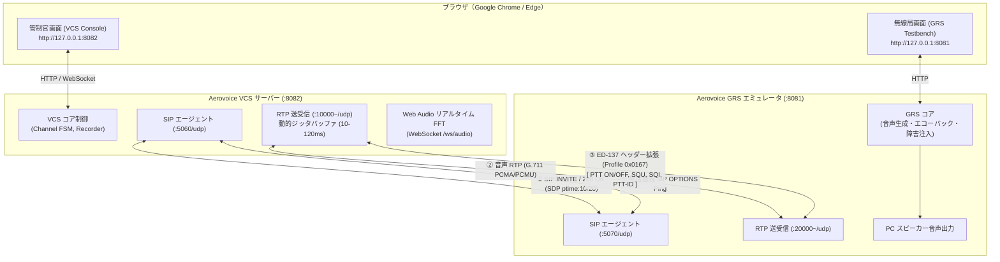
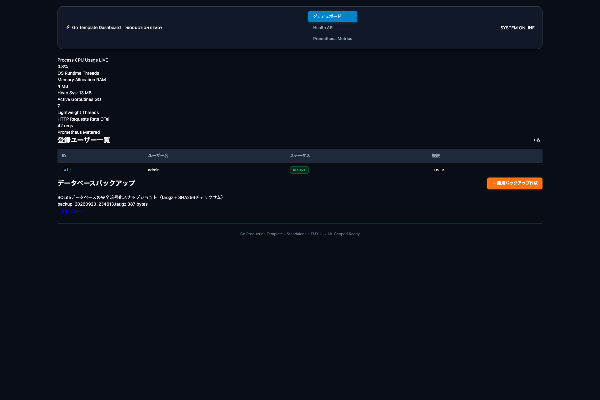

# Aerovoice - EUROCAE ED-137C Radio & Telephony Verification Suite

> [!NOTE]
> **本ソフトウェアの目的と位置づけ**:
> Aerovoice は、航空管制音声通信規格 **EUROCAE ED-137C**（主に Volume 1 Radio, Volume 2 Telephone, Volume 4 Recording, Volume 5 Supervision）の検証・学習・相互接続試験を目的とした**オープンソースのプロトタイプ実装**です。
> 第三者認証機関による型式証明や公的認証を受けた製品ではなく、規格書の本文・図表の転載は含みません。

---

## ✈️ 概要 (Overview)

Aerovoice は、管制卓（VCS: Voice Communication System）コンソールと、対向の地上無線局（GRS: Ground Radio Station）シミュレータを完全なピュアGo（`CGO_ENABLED=0`）で提供する統合テストベンチです。
外部の専用ハードウェアや CGO/C ライブラリに依存せず、**Windows および macOS（Apple Silicon / Intel）** の双方で即座にビルド・実行可能です。

ブラウザを2画面開くだけで、VCS側（`http://127.0.0.1:8082`）とGRS側（`http://127.0.0.1:8081`）の間で、PTT送話、地上局受話、スケルチ（SQU）送出、電話短縮発信、1kHz試験トーン、300msエコーバック、リアルタイムFFTスペクトラムによる音声品質確認、パケットキャプチャ（PCAP）の事後診断までを一気通貫で検証できます。

---

## 🚀 主な機能 (Key Features)

### 1. Radio (ED-137C Volume 1 相当)
- **SIP/SDP 呼制御**: RFC 4566 / RFC 3261 に準拠したセッション確立（`a=ptime:10`, `a=ptime:20` 両対応、G.711 A-law / μ-law ネゴシエーション）。
- **ED-137 RTP ヘッダ拡張**: Profile `0x0167` による PTT Type（Normal / Priority / Emergency）、PTT-ID、Downlink Squelch（SQU）、Signal Quality Index（SQI 0〜100）の完全送受信。
- **Web Audio API & リアルタイム FFT スペクトラム**: マイク入力（ブラウザ標準）および受信音声を 8kHz でサンプリングし、Canvas 上に 60FPS のリアルタイムオーディオスペクトラム（0〜4kHz）と VU メーターを描画。1kHz 試験トーンのピークや音声フォルマントを視覚的に確認可能。
- **動的ジッタバッファ**: UI のスライダーから 10ms 〜 120ms のジッタバッファ遅延を動的に調整可能。RFC 3550 Interarrival Jitter と送信ジッタ（OSスケジューラ分散）をリアルタイム表示。

### 2. Telephony (ED-137C Volume 2 相当)
- **Direct Access (DA) 短縮通話**: 管制卓間のダイレクト通話をワンクリックで発信・着信（Full-Duplex）。
- **1kHz 試験トーン通話**: 1000Hz 純粋正弦波による回線疎通・音響歪み検証。
- **300ms エコーバック通話**: 受信した音声を 300ms 遅延させて折り返すループバック通話による受話確認。

### 3. Recordings (ED-137C Volume 4 相当)
- **自動 WAV ロギング**: PTT 送信時、SQU 受信時、電話通話時に自動で 8kHz 16-bit Linear PCM WAV ファイルを生成・カタログ化。
- **ブラウザインライン再生**: 録音タブからワンクリックで再生およびダウンロード可能。

### 4. Supervision (ED-137C Volume 5 相当)
- **SIP OPTIONS 死活監視**: GRS ノードに対してバックグラウンドで OPTIONS リクエストを定期送出し、RTT（往復遅延）とオンライン/オフライン状態をリアルタイム表示。

### 5. PCAP 事後診断エンジン (Post-Mortem Analysis)
- **ピュア Go PCAP パーサー**: `pcapgo` を用いた CGO/外部ライブラリ非依存の PCAP/PCAPNG 解析。
- **VoIP コール & ED-137 抽出**: パケットごとの PTT/SQU/SQI/ジッタ推移タイムラインを可視化。
- **音声復元**: PCAP 内の RTP ペイロードから音声を自動復元し、ブラウザ上で即座に再生可能。

### 6. GRS シミュレータ・テストベンチ (`http://127.0.0.1:8081`)
- **生スピーカー受話確認**: VCS から PTT 送信された音声を、対向 GRS 側のコンソールで直接スピーカー再生＆VU/FFT 表示。
- **SQU 制御 & 音声ソース切替**: スケルチ ON/OFF、1kHzトーン、ビープ音、模擬音声フォルマントの送出。
- **人工ネットワーク障害注入**: ジッタ（0〜100ms）およびパケットロス（0〜50%）のリアルタイム注入。
- **Silent Drop 障害シミュレーション**: SIP OPTIONS を意図的に無視し、Supervision の異常検知シナリオを再現。

---

## 🛠️ クイックスタート (Quick Start)

### 1. 2画面インタラクティブデモの即時起動 (推奨)
以下のコマンドで、VCS コンソールと GRS テストベンチが同時にバックグラウンド起動します：
```bash
make demo-vcs
```
- **VCS 統合コンソール**: [http://127.0.0.1:8082](http://127.0.0.1:8082) （管制官のオペレーション卓）
- **GRS テストベンチ**: [http://127.0.0.1:8081](http://127.0.0.1:8081) （地上無線基地局エミュレータ）

> 📖 **詳細な操作方法・全シナリオ・トラブルシューティングは [docs/manual.md](docs/manual.md) をご覧ください。**

---

## 📡 システム接続構成図 (VCS & GRS)

Aerovoice の内部では、VCS と GRS が以下のポートとプロトコル（EUROCAE ED-137C 準拠）で協調動作しています：



### 🎮 5分で体験するクイック手順

1. **2画面を左右に並べる**:
   - 左画面: [http://127.0.0.1:8082](http://127.0.0.1:8082) (VCS)
   - 右画面: [http://127.0.0.1:8081](http://127.0.0.1:8081) (GRS)
   - 左画面（VCS）右上の **「🔊 Enable Audio」** をクリック。
2. **無線を発信する (PTT 送信)**:
   - 左画面の `TWR Main` で **「Connect to GRS」** をクリックして接続。
   - **「PUSH TO TALK」** ボタンまたは **スペースキー長押し** で送信！
   - 右画面（GRS）の VU メーターが振れ、PC スピーカーから受話音が流れます。
3. **電波を受信する (SQU 受信 & FFT スペクトラム)**:
   - 右画面（GRS）の **「Squelch Downlink」** を ON にする。
   - 左画面（VCS）の **SQU ランプが点灯** し、Canvas に **400Hz のスペクトラムピーク** が 60FPS で描画されます。
4. **直通電話をかける (Telephony DA)**:
   - 左画面の「Telephony」タブから **「1kHz Tone Test Call」** または **「300ms Echo Loopback Test」** をクリック。
   - 全二重通話とジッタ測定が実行されます。
5. **録音を聞く (Recordings)**:
   - 「Recordings」タブで交信音声（WAV）をブラウザ上で即座に再生・ダウンロード可能。

### 2. 個別起動
```bash
# ターミナル 1: GRS エミュレータの起動
make grs-run

# ターミナル 2: VCS コンソールの起動
make vcs-run
` + "```" + `

### 3. クロスコンパイル (Windows / macOS)
` + "```bash" + `
make build-cross
` + "```" + `
`bin/dist/` 配下に以下の実行可能ファイルが生成されます：
- Windows (x86_64): `vcs-windows-amd64.exe`, `grs-windows-amd64.exe`
- macOS (Apple Silicon): `vcs-darwin-arm64`, `grs-darwin-arm64`
- macOS (Intel): `vcs-darwin-amd64`, `grs-darwin-amd64`

### 4. 自動テストの実行
` + "```bash" + `
make aerovoice-test
` + "```" + `

---

## 🏛️ リポジトリ基盤について
本リポジトリは、エンタープライズ Go 開発用テンプレートをベースにしており、以下の機能も内包しています：


---

## 📸 スクリーンショット & レポート

| HTMX スタンドアロンダッシュボード | 自動生成された HTML 検証レポート |
| :---: | :---: |
|  | `test_reports/frontend_e2e_report.html` |

---

## 🛠️ クイックスタート

### 1. このリポジトリから新規リポジトリを作成
GitHubの「Use this template」ボタンから、ご自身のリポジトリを作成します。

### 2. モジュール名の変更
作成したリポジトリの `go.mod` 内のモジュール名を変更します。
```go
module github.com/your-username/your-repo-name
```
また、`main.go` や `.goreleaser.yaml` などに含まれるプロジェクト名も必要に応じて書き換えてください。

### 3. ローカル即時起動
Docker 不要で、API サーバーと Web ダッシュボードを即座に起動します：
```bash
make run
```
- Web ダッシュボード: `http://localhost:3001`
- REST API / ヘルスチェック: `http://localhost:8080/v1/system/healthz`

### 4. AI カスタムスキルのインストール
```bash
make install-all
```
*(Claude Code 向けに `~/.claude/skills/` へ、Antigravity 向けに `.agents/skills/` へ配備)*

---

## ⚙️ 開発コマンド一覧

Makefile に定義されている以下のコマンドを使用して開発を進めます：

| コマンド | 説明 |
| :--- | :--- |
| `make run` | スタンドアロンサーバー（Core API + Web UI）のローカル一括起動 |
| `make aerovoice-test` | Aerovoice ED-137 無線・電話・HTMX E2E テストスイートの実行 |
| `make vcs-frontend-e2e` | Aerovoice VCS HTMX フロントエンド E2E テスト & ビジュアルレポート生成 |
| `make demo-vcs` | VCS 管制卓 & GRS 局インタラクティブ 2 画面デモの起動 |
| `make sqlite-e2e` | Docker 不要の超高速 SQLite E2E テストの実行 |
| `make frontend-e2e` | スタンドアロン HTMX フロントエンド E2E テスト & スナップショット生成 |
| `make docker-e2e` | Docker Compose フルスタック E2E テスト & Grafana 検証 |
| `make ssg-build` | Go テンプレートからの静的サイト事前レンダリング出力 (SSG) |
| `make demo` | フルスタック・インタラクティブデモの起動 |
| `make test` | データ競合検知 (`-race`) およびカバレッジ測定付き単体テスト |
| `make fmt` | ソースコードのフォーマットおよびリンターによる自動修正 |
| `make lint` | `golangci-lint` を使用した静的解析の実行 |
| `make vulncheck` | `govulncheck` を使用した脆弱性診断の実行 |
| `make build` | `bin/app` および `bin/web` へのコンパイル |
| `make release-check` | `GoReleaser v2` 設定ファイルのバリデーション |
| `make release-snapshot` | `GoReleaser` によるローカルでのスナップショットビルドテスト |
| `make license-check` | Go ソースコードのライセンス＆作成者ヘッダーの検証 |
| `make license-add` | ライセンスヘッダーの自動付与 |
| `make check` | 同梱スキルのマークダウン構文チェック |
| `make self-eval` | リポジトリ要件の自己評価の実行 (`REQUIREMENTS.md` の更新) |
| `make clean` | ビルド成果物やテストキャッシュのクリーンアップ |

---

## ☁️ さくらのクラウド Terraform CI/CD

本テンプレートには、さくらのクラウド用の Terraform CI/CD ワークフローが含まれています。`terraform/` ディレクトリ配下のファイルに変更があった場合のみトリガーされます。

### 🔑 GitHub Secrets の設定
以下の GitHub Secrets をリポジトリに登録してください：
- `SAKURA_ACCESS_TOKEN` / `SAKURA_ACCESS_TOKEN_SECRET`
- `AWS_ACCESS_KEY_ID` / `AWS_SECRET_ACCESS_KEY`

---

## 📋 REQUIREMENTS.md による品質自己評価

`make self-eval` コマンドを実行すると、`REQUIREMENTS.md` のチェックボックス（`[x]`）が集計され、適合率（パーセンテージ）が自動計算されてファイル下部に反映されます。
常に適合率 100% を維持する開発プラクティスを推奨します。
