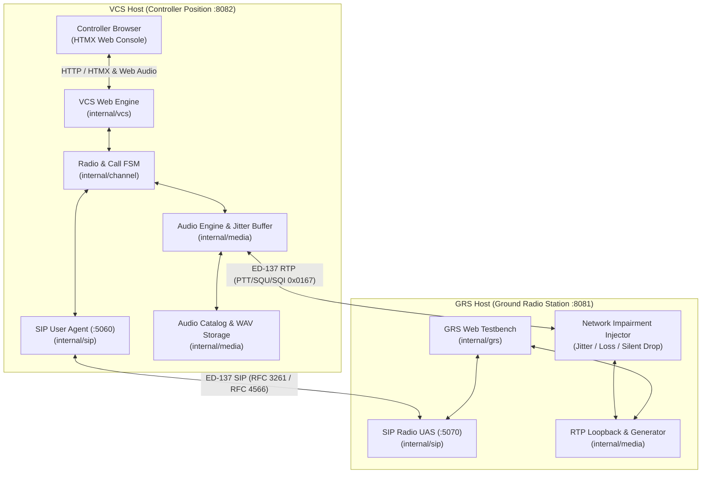

# Aerovoice - EUROCAE ED-137C Radio & Telephony Verification Suite

[](https://github.com/sh0jitmy/aerovoice/actions/workflows/ci.yml)
[](https://golang.org)
[](https://www.eurocae.net)
[](https://sh0jitmy.github.io/aerovoice/)
[](LICENSE)

[English](README.md) | [日本語](README.ja.md)

> [!NOTE]
> **Purpose and Scope of This Software**:
> Aerovoice is an open-source prototype implementation designed for learning, verification, and interoperability testing of the European aviation VoIP standard **EUROCAE ED-137C** (specifically Volume 1 Radio, Volume 2 Telephone, Volume 4 Recording, and Volume 5 Supervision).
> It is not a commercially certified or type-approved avionics product and does not contain copyrighted normative figures or text from the EUROCAE specification documents.

---

## ✈️ Overview

Aerovoice is an enterprise-grade Air Traffic Management (ATM) voice communication testbench providing both a controller Voice Communication System (**VCS**) console and a Ground Radio Station (**GRS**) emulator in **100% Pure Go (`CGO_ENABLED=0`)**.
With zero CGO dependencies and zero external database requirements, it compiles and runs seamlessly across **macOS (Apple Silicon / Intel)** and **Windows (x86_64)**. It features full dual-language internationalization (English & Japanese) and realistic aviation phraseology audio.

By simply opening two browser tabs, operators and engineers can verify end-to-end aeronautical VoIP communication between the VCS console (`http://127.0.0.1:8082`) and the GRS testbench (`http://127.0.0.1:8081`):
- **Push-To-Talk (PTT)** transmission with ED-137 RTP header extensions
- **Downlink Squelch (SQU)** reception with 60 FPS real-time Web Audio FFT spectrum visualization
- **Direct Access (DA)** ground-to-ground telephony calls (1 kHz tone, 300 ms echo loopback, speech verification)
- **Dynamic Jitter Buffering** (10 ms – 120 ms slider control) and artificial network impairment injection (jitter & packet loss)
- **Audio Recording Catalog** with inline browser WAV playback and download (ED-137 Volume 4)
- **Live Node Supervision** with real-time SIP keepalive RTT latency monitoring (ED-137 Volume 5)
- **Offline PCAP Analyzer** for decoding ED-137 RTP headers and restoring audio waveforms

All E2E test results, visual screenshots, and verification metrics are automatically published to [GitHub Pages](https://sh0jitmy.github.io/aerovoice/) (available in both English and Japanese).

---

## 🚀 Key Features

### 1. Aeronautical Radio (EUROCAE ED-137C Volume 1)
- **SIP/SDP Call Control**: RFC 3261 and RFC 4566 compliant radio session establishment supporting both `a=ptime:10` and `a=ptime:20`, with G.711 A-law and μ-law negotiation.
- **ED-137 RTP Header Extensions**: Profile `0x0167` encoding and decoding for PTT Type (Normal / Priority / Emergency), PTT-ID, Downlink Squelch (SQU), and Signal Quality Index (SQI 0–100).
- **Web Audio API & 60 FPS Canvas FFT**: Real-time 8 kHz sampling in the browser rendering an audio spectrum (0–4 kHz) and responsive VU meter. Displays speech formants from realistic aviation English ("Radio check, radio check...") and Japanese test phrases.
- **Acoustic Silence Control (Audio ON / OFF)**: Fully suspends the Web Audio `AudioContext` and microphone media stream when Audio is OFF, eliminating background speaker hiss and microphone loopback.
- **Dynamic Jitter Buffer & Scheduled Playout**: Precise FIFO scheduling queue preventing audio crackling or overlapping packets, with real-time buffer depth adjustments between 10 ms and 120 ms.

### 2. Ground-to-Ground Telephony (EUROCAE ED-137C Volume 2)
- **Direct Access (DA) Speed Dialing**: One-click full-duplex intercom calls between controller positions.
- **Multi-Language Speech Test Calls**: Automated English ATC speech ("This is an ED-137 telephone quality test...") and Japanese speech playback for clear voice intelligibility assessment.
- **1 kHz Pure Tone Call**: 1000 Hz sinusoidal test tone for line continuity and acoustic distortion validation.
- **300 ms Echo Loopback Call**: Transmits received audio back to the caller delayed by 300 ms for self-monitoring.

### 3. Legal Recording & Archiving (EUROCAE ED-137C Volume 4)
- **Automated WAV Catalog**: Captures all PTT transmissions, SQU downlinks, and telephony calls into timestamped 8 kHz 16-bit Linear PCM WAV files.
- **Browser Inline Playback**: Listen to recordings directly in the browser or download them for external audit.

### 4. Station Supervision (EUROCAE ED-137C Volume 5)
- **SIP OPTIONS Keepalive**: Automated 5-second background ping to GRS endpoints, measuring millisecond-level round-trip time (RTT) and reporting station online/offline health.
- **Fault Injection Simulation**: Simulate station outages via GRS "Silent Drop" to observe VCS failover detection.

### 5. Post-Incident PCAP Analyzer
- **In-Browser Wireshark Alternative**: Drag and drop `.pcap` capture files to inspect SIP signaling and ED-137 RTP packets.
- **Waveform Reconstruction**: Reassembles G.711 RTP payloads from capture files into playable WAV audio.

---

## 🏗️ System Architecture



---

## ⚡ 5-Minute Interactive Quickstart

Experience a realistic two-screen aeronautical communication session using your local browser:

### Step 1: Launch VCS and GRS Services

Open two terminal windows:

```bash
# Terminal 1: Start GRS Ground Radio Station Emulator (port 8081)
make grs-run

# Terminal 2: Start VCS Controller Console (port 8082)
make vcs-run
```

*(Alternatively, run `make demo` to automatically start both services).*

### Step 2: Open Dual Browser Consoles

Arrange two browser windows side by side:
- **Left Window (VCS Console)**: [http://127.0.0.1:8082](http://127.0.0.1:8082)
- **Right Window (GRS Testbench)**: [http://127.0.0.1:8081](http://127.0.0.1:8081)

Click the **"🔊 Enable Audio"** button in the top-right corner of the VCS console to activate browser audio synthesis.

### Step 3: Test Push-To-Talk (PTT) Transmission
1. In the VCS console under **TWR Main (118.100 MHz)**, click **"Connect to GRS"**.
2. Click **"PUSH TO TALK"** (or hold **Spacebar**), or click **"🗣️ Send ATC Voice (Speech TX)"**.
3. Observe the green PTT lamp turn active on VCS, while the GRS VU meter deflects and audio plays through your speakers.

### Step 4: Test Squelch (SQU) Reception & 60 FPS FFT Spectrum
1. In the GRS console (right window), toggle **"Squelch Downlink"** to **ON**.
2. In the VCS console (left window), observe the **SQU lamp illuminate**.
3. Watch the **Canvas FFT Spectrum Analyzer** render the live audio spectrum and formants at 60 FPS.

### Step 5: Test Ground-to-Ground Telephony (Direct Access)
1. In the VCS console, switch to the **"Telephony (DA)"** tab.
2. Click **"Human Speech Test Call"** or **"1kHz Tone Test Call"**.
3. An ED-137 full-duplex telephone call is established immediately, streaming voice prompts and updating jitter measurements in real time.

---

## ⚙️ Configuration

Aerovoice configuration is centrally managed via YAML files in `configs/`:

### VCS Configuration (`configs/vcs.yaml`)
```yaml
vcs:
  sip_host: "127.0.0.1"
  sip_port: 5060
  rtp_host: "127.0.0.1"
  rtp_port_start: 10000
  web_host: "127.0.0.1"
  web_port: 8082
  default_ptime: 10
  default_jitter_buffer_ms: 40

channels:
  - id: "ch-twr"
    name: "TWR Main"
    frequency: "118.100 MHz"
    grs_sip_uri: "sip:radio@127.0.0.1:5070"
    role: "Main"
    ptime: 10
    jitter_buffer_ms: 40

telephony:
  direct_access:
    - id: "da-twr"
      name: "TWR Tower"
      target_sip_uri: "sip:101@127.0.0.1:5070"
    - id: "da-speech-test"
      name: "Speech Test Call"
      target_sip_uri: "sip:speech-test@127.0.0.1:5070"
```

### GRS Configuration (`configs/grs.yaml`)
```yaml
grs:
  station_name: "Tokyo-GRS-01"
  frequency: "118.100 MHz"
  sip_host: "127.0.0.1"
  sip_port: 5070
  rtp_host: "127.0.0.1"
  rtp_port: 20000
  web_host: "127.0.0.1"
  web_port: 8081
  default_ptime: 10
  loopback_echo: true
  audio_source: "pilot_voice" # Options: pilot_voice (EN), pilot_voice_ja (JA), tone_1khz, beep_400hz, loopback
  telephone:
    auto_answer: true
    auto_answer_mode: "speech"
```

---

## 🛠️ Build & Development Commands

```bash
# Build applications
make build            # Build bin/vcs and bin/grs-emulator
make build-windows    # Cross-compile Windows (x86_64) binaries in bin/dist/
make build-cross      # Cross-compile for Windows and macOS

# Running services
make vcs-run          # Launch VCS console on http://127.0.0.1:8082
make grs-run          # Launch GRS emulator on http://127.0.0.1:8081
make demo             # Launch automated interactive 2-screen demo

# Code quality & static analysis
make fmt              # Format Go source code
make lint             # Run golangci-lint (0-issue enforcement)
make license-check    # Verify Apache-2.0 and author license headers

# Multi-Tier E2E Testing
make test             # Run unit tests with -race and coverage verification (>= 80%)
make aerovoice-test   # Run ED-137 protocol verification test suite
make vcs-frontend-e2e # Run Headless Chrome E2E test suite & generate visual HTML reports
```

---

## 🔬 Multi-Tier E2E Testing & GitHub Pages

Aerovoice enforces a strict multi-tier verification framework:

| Test Tier | Command | Scope & Verification |
| :--- | :--- | :--- |
| **Layer 1: Unit & Protocol Tests** | `make test` | Parallel unit tests with `goleak` goroutine leak detection and >=80% core statement coverage check. |
| **Layer 2: Protocol Integration** | `make aerovoice-test` | End-to-end SIP/SDP negotiation, RTP G.711 codec roundtrip, and ED-137 `0x0167` header validation. |
| **Layer 3: Visual Frontend E2E** | `make vcs-frontend-e2e` | Automated Headless Chrome testing verifying all HTMX tabs, Web Audio API, and generating bilingual visual HTML reports. |

### Live GitHub Pages Reports
Visual E2E test reports, test assertion matrices, and headless Chrome multi-tab snapshots are published on GitHub Pages:
- **Landing Portal**: [https://sh0jitmy.github.io/aerovoice/](https://sh0jitmy.github.io/aerovoice/)
- **English Visual E2E Report**: [https://sh0jitmy.github.io/aerovoice/en/](https://sh0jitmy.github.io/aerovoice/en/)
- **Japanese Visual E2E Report**: [https://sh0jitmy.github.io/aerovoice/ja/](https://sh0jitmy.github.io/aerovoice/ja/)

---

## 📜 Compliance & Standards

Aerovoice implements key profiles defined in the following international standards:
- **EUROCAE ED-137C Volume 1**: Interoperability Standards for VoIP ATM Systems (Radio).
- **EUROCAE ED-137C Volume 2**: Interoperability Standards for VoIP ATM Systems (Telephone).
- **EUROCAE ED-137C Volume 4**: Recording Interfaces for VoIP ATM Systems.
- **EUROCAE ED-137C Volume 5**: Supervision and Monitoring for VoIP ATM Systems.
- **IETF RFC 3261**: SIP: Session Initiation Protocol.
- **IETF RFC 4566**: SDP: Session Description Protocol.
- **IETF RFC 3550**: RTP: A Transport Protocol for Real-Time Applications.

---

## 📄 License

This project is licensed under the **Apache License 2.0**. See the [LICENSE](LICENSE) file for details.
