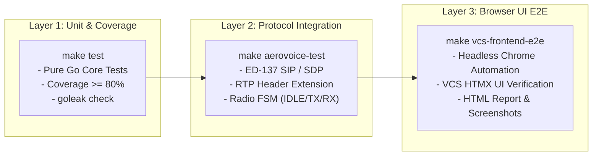

<!--
Copyright 2026 [Copyright Holder]

Licensed under the Apache License, Version 2.0 (the "License");
you may not use this file except in compliance with the License.
You may obtain a copy of the License at

    http://www.apache.org/licenses/LICENSE-2.0

Unless required by applicable law or agreed to in writing, software
distributed under the License is distributed on an "AS IS" BASIS,
WITHOUT WARRANTIES OR CONDITIONS OF ANY KIND, either express or implied.
See the License for the specific language governing permissions and
limitations under the License.

Author: [YOUR_NAME]
-->

# Aerovoice System Architecture & Technical Specifications

[English](architecture.md) | [日本語](architecture.ja.md)

本書は、**Aerovoice（EUROCAE ED-137 航空管制音声通信検証スイート）** のシステム全体アーキテクチャ、コンポーネント構成、データフロー、およびテスト階層について詳述します。

---

## 1. 全体アーキテクチャ概要

Aerovoice は管制卓（**VCS**）と地上無線局エミュレータ（**GRS**）の2つの独立した Pure Go プロセスで構成され、SIP/SDP による呼制御および RTP / ED-137 ヘッダー拡張による低遅延音声伝送を行います。

```mermaid
graph TD
    subgraph "VCS Host (Controller Position :8082)"
        Browser["Controller Browser<br/>(HTMX Web Console)"]
        VCS_Web["VCS Web Engine<br/>(internal/vcs)"]
        VCS_FSM["Radio & Call FSM<br/>(internal/channel)"]
        VCS_Media["Audio Engine & Jitter Buffer<br/>(internal/media)"]
        VCS_SIP["SIP User Agent (:5060)<br/>(internal/sip)"]
        VCS_Recorder["In-Memory Audio Catalog<br/>& WAV Storage"]
    end

    subgraph "GRS Host (Ground Radio Station :8081)"
        GRS_Web["GRS Web Testbench<br/>(internal/grs)"]
        GRS_SIP["SIP Radio UAS (:5070)<br/>(internal/sip)"]
        GRS_Media["RTP Loopback & Generator<br/>(internal/media)"]
        GRS_Impair["Network Impairment Injector<br/>(Jitter / Loss / Silent Drop)"]
    end

    Browser <-->|HTTP / HTMX & Web Audio| VCS_Web
    VCS_Web <--> VCS_FSM
    VCS_FSM <--> VCS_Media
    VCS_FSM <--> VCS_SIP
    VCS_Media <--> VCS_Recorder

    VCS_SIP <-->|ED-137 SIP (RFC 3261 / RFC 4566)| GRS_SIP
    VCS_Media <-->|ED-137 RTP (PTT/SQU/SQI 0x0167)| GRS_Impair
    GRS_Impair <--> GRS_Media
    GRS_Web <--> GRS_SIP
    GRS_Web <--> GRS_Media
```

---

## 2. コアコンポーネント設計

### 2.1 エントリーポイント構成
- **`cmd/vcs`**:
  - 管制卓（VCS: Voice Communication System）コンソールのメインプロセス。
  - HTMX ダッシュボード（`:8082`）、SIP エージェント（`:5060/udp`）、RTP メディアエンジン（`:10000〜/udp`）を起動。
- **`cmd/grs-emulator`**:
  - 対向の地上無線基地局（GRS: Ground Radio Station）シミュレータ。
  - GRS テストベンチ（`:8081`）、SIP 無線局 UAS（`:5070/udp`）、RTP エコーバック/トーン生成器（`:20000〜/udp`）を起動。

### 2.2 スタンドアロン HTMX Web コンソール (`internal/vcs`, `internal/grs`)
- **`//go:embed` 組み込み**:
  - HTML テンプレート、HTMX ライブラリ、およびモダンなダークモード CSS を Go バイナリ内に完全内包。外部 CDN や Node.js/npm なしで完全にオフライン動作。
- **Hypermedia-Driven レンダリング & Web Audio**:
  - 周波数選択、PTT/スケルチ状態、電話発着信、および死活監視ステータスをリアルタイム部分更新。
  - Web Audio API（AudioContext）による 60FPS FFT 音声スペクトラム（0〜4kHz）と VU メーター描画。
  - 完全無音化（Audio OFF）：マイク入力トラックとオーディオコンテキストを物理停止し、暗騒音漏れをゼロ化。

### 2.3 航空通信プロトコル層 (`internal/ed137`, `internal/sip`, `internal/media`)
- **ED-137 SIP シグナリング (`internal/sip`)**:
  - `sipgo` を用いた Pure Go SIP 呼制御。INVITE / 200 OK / BYE によるセッション確立および SDP ネゴシエーション（G.711 μ-law / A-law, `ptime:20`）。
- **ED-137 RTP ヘッダー拡張 (`internal/ed137`)**:
  - Profile `0x0167` による PTT Type（Normal / Priority / Emergency）、PTT-ID、Downlink Squelch（SQU）、Signal Quality Index（SQI 0〜100）の完全送受信。
- **動的適応型ジッタバッファ (`internal/media/jitter_buffer.go`)**:
  - ネットワーク遅延・パケット順序逆転・揺らぎを吸収するキュー制御（10ms〜120ms 動的調整）。
- **録音クォータ管理 (`internal/media/recorder.go`)**:
  - PTT 送信時および SQU 受信時に自動で 8kHz 16-bit Linear PCM WAV ファイルを生成。
  - 最大録音件数（デフォルト100件）および最大録音時間（デフォルト5分）の上限管理と自動ローテーション。

### 2.4 PCAP 事後診断エンジン (`internal/pcap`)
- `pcapgo` を用いた CGO 非依存の PCAP/PCAPNG 解析。
- VoIP コール・ED-137 拡張ヘッダー（PTT/SQU/SQI）の時系列抽出と音声 WAV 復元。

---

## 3. 多層 E2E テストフレームワーク


