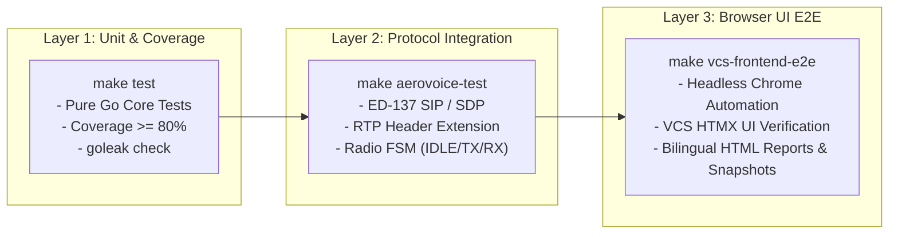

<!--
Copyright 2026 [Copyright Holder]

Licensed under the Apache License, Version 2.0 (the "License");
you may not use this file except in compliance with the License.
You may obtain a copy of the License at

    http://www.apache.org/licenses/LICENSE-2.0

Unless required by applicable law or agreed to in writing, software
distributed under the License is distributed on an "AS IS" BASIS,
WITHOUT WARRANTIES OR CONDITIONS OF ANY KIND, either express or implied.
See the License for the specific language governing permissions and
limitations under the License.

Author: [YOUR_NAME]
-->

# Aerovoice System Architecture & Technical Specifications

[English](architecture.md) | [日本語](architecture.ja.md)

This document details the overall system architecture, component design, data flow, and testing tiers for **Aerovoice**, an open-source EUROCAE ED-137 Aeronautical Voice Communication verification suite.

---

## 1. Overall System Architecture

Aerovoice consists of two independent Pure Go processes: the controller console (**VCS**) and the Ground Radio Station emulator (**GRS**). They establish call control via SIP/SDP and stream low-latency VoIP audio using RTP with EUROCAE ED-137 header extensions.

```mermaid
graph TD
    subgraph "VCS Host (Controller Position :8082)"
        Browser["Controller Browser<br/>(HTMX Web Console)"]
        VCS_Web["VCS Web Engine<br/>(internal/vcs)"]
        VCS_FSM["Radio & Call FSM<br/>(internal/channel)"]
        VCS_Media["Audio Engine & Jitter Buffer<br/>(internal/media)"]
        VCS_SIP["SIP User Agent (:5060)<br/>(internal/sip)"]
        VCS_Recorder["In-Memory Audio Catalog<br/>& WAV Storage"]
    end

    subgraph "GRS Host (Ground Radio Station :8081)"
        GRS_Web["GRS Web Testbench<br/>(internal/grs)"]
        GRS_SIP["SIP Radio UAS (:5070)<br/>(internal/sip)"]
        GRS_Media["RTP Loopback & Generator<br/>(internal/media)"]
        GRS_Impair["Network Impairment Injector<br/>(Jitter / Loss / Silent Drop)"]
    end

    Browser <-->|HTTP / HTMX & Web Audio| VCS_Web
    VCS_Web <--> VCS_FSM
    VCS_FSM <--> VCS_Media
    VCS_FSM <--> VCS_SIP
    VCS_Media <--> VCS_Recorder

    VCS_SIP <-->|ED-137 SIP (RFC 3261 / RFC 4566)| GRS_SIP
    VCS_Media <-->|ED-137 RTP (PTT/SQU/SQI 0x0167)| GRS_Impair
    GRS_Impair <--> GRS_Media
    GRS_Web <--> GRS_SIP
    GRS_Web <--> GRS_Media
```

---

## 2. Core Component Design

### 2.1 Entrypoint Binaries
- **`cmd/vcs`**:
  - Main binary for the controller Voice Communication System console.
  - Launches the HTMX dashboard (`:8082`), SIP User Agent (`:5060/udp`), and RTP Media Engine (`:10000~/udp`).
- **`cmd/grs-emulator`**:
  - Ground Radio Station emulator binary.
  - Launches the GRS Web Testbench (`:8081`), SIP Radio UAS (`:5070/udp`), and RTP Echo/Tone Generator (`:20000~/udp`).

### 2.2 Standalone HTMX Web Consoles (`internal/vcs`, `internal/grs`)
- **Embedded Static Assets (`//go:embed`)**:
  - HTML templates, local HTMX library (`static/htmx.min.js`), and avionics-style CSS are compiled directly into Go binaries. Works 100% offline without Node.js or CDN dependencies.
- **Hypermedia-Driven Rendering & Web Audio**:
  - Frequency selection, PTT/SQU states, telephone dialing, and supervision metrics are dynamically updated via HTMX partial swaps.
  - The browser Web Audio API samples microphone inputs and streams audio, driving a 60 FPS Canvas FFT audio spectrum (0–4 kHz) and VU meters.
  - Full silence mode (Audio OFF) physically halts microphone tracks and suspends the audio context to eliminate background speaker hiss.
- **Dual-Language i18n**:
  - Integrated language toggle supporting English and Japanese interfaces, quickstart guides, and documentation.

### 2.3 Aeronautical Protocol Stack (`internal/ed137`, `internal/sip`, `internal/media`)
- **ED-137 SIP Signaling (`internal/sip`)**:
  - Pure Go SIP call control using `sipgo`. Handles INVITE / 200 OK / BYE session establishment and SDP negotiation (G.711 μ-law / A-law, `ptime:10` and `ptime:20`).
- **ED-137 RTP Header Extensions (`internal/ed137`)**:
  - Profile `0x0167` serialization for PTT Type (Normal / Priority / Emergency), PTT-ID, Downlink Squelch (SQU), and Signal Quality Index (SQI 0–100).
- **Dynamic Playout & Jitter Buffer (`internal/media/jitter_buffer.go`)**:
  - Reorders out-of-sequence packets and absorbs network jitter with user-tunable depth (10 ms – 120 ms).
- **Audio Catalog & Retention Cleaner (`internal/media/recorder.go`)**:
  - Automatically records all PTT transmissions and SQU receptions into 8 kHz 16-bit Linear PCM WAV files.
  - Enforces quota limits (default 100 recordings, max 5 minutes per recording) and retention policies.

### 2.4 PCAP Post-Incident Analyzer (`internal/pcap`)
- Pure Go PCAP parsing using `pcapgo` (zero CGO/libpcap dependency).
- Extracts SIP call flows, ED-137 extension headers (PTT/SQU/SQI), and reconstructs G.711 payloads into playable WAV audio.

---

## 3. Multi-Tier E2E Testing Framework


