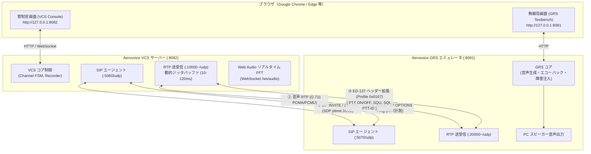
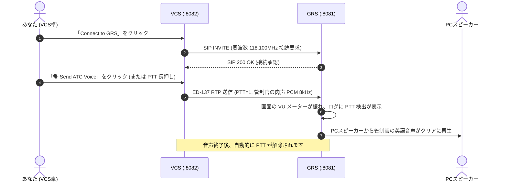

# Aerovoice 操作・検証マニュアル (User & Verification Manual)

EUROCAE ED-137C Radio & Telephony 検証用 OSS プロトタイプ「Aerovoice」の操作手順、VCS・GRS 接続アーキテクチャ、および各種検証シナリオを解説するマニュアルです。

---

## 1. システム概要と接続構成図

Aerovoice は、管制官が操作する **VCS（Voice Communication System）** と、滑走路脇などのアンテナ局である **GRS（Ground Radio Station）** の 2 つの独立したプログラムが、標準規格 **EUROCAE ED-137C** に則って UDP 通信を行う構成になっています。

### 1.1 ネットワーク & プロトコル接続図



### 1.2 ポート割り当て一覧

| コンポーネント | ポート | プロトコル | 用途 |
| :--- | :--- | :--- | :--- |
| **VCS Web Console** | `8082` | HTTP / WebSocket | 管制官用 Web UI 画面、FFT メトリクス配信 |
| **GRS Testbench** | `8081` | HTTP | 地上無線局エミュレータ用 Web UI 画面 |
| **VCS SIP Agent** | `5060` | UDP | ED-137 呼制御シグナリング（クライアント/サーバー） |
| **GRS SIP Agent** | `5070` | UDP | ED-137 呼制御シグナリング（対向局サーバー） |
| **VCS RTP** | `10000`〜 | UDP | 音声送受信（G.711 A-law/μ-law + ED-137 拡張） |
| **GRS RTP** | `20000`〜 | UDP | 音声送受信（G.711 A-law/μ-law + ED-137 拡張） |

---

## 2. 2画面インタラクティブ環境の立ち上げ

### 2.1 サーバーの起動
ターミナルから以下のコマンドを実行します。VCS と GRS が自動的にバックグラウンド起動します。
```bash
make demo-vcs
```
*(個別に起動したい場合は `make grs-run` と `make vcs-run` を別ターミナルで実行してください)*

### 2.2 ブラウザの配置
ブラウザ（Google Chrome / Microsoft Edge 推奨）でウィンドウを 2 つ開き、左右に並べます。

```
+------------------------------------+------------------------------------+
|  左画面: VCS コンソール             |  右画面: GRS テストベンチ           |
|  http://127.0.0.1:8082             |  http://127.0.0.1:8081             |
|  (管制官のオペレーション卓)        |  (滑走路脇の無線中継基地局)        |
+------------------------------------+------------------------------------+
```

1. **左画面** で [**http://127.0.0.1:8082**](http://127.0.0.1:8082) を開きます。
2. **右画面** で [**http://127.0.0.1:8081**](http://127.0.0.1:8081) を開きます。
3. **左画面（VCS）の右上** にある **「🔊 Enable Audio」** ボタンを一度クリックします（ブラウザの Web Audio API 音声出力を有効化するため）。

---

## 3. ステップ・バイ・ステップ操作手順

### シナリオ 1: 無線を発信する (人の声で PTT 送話テスト)
管制官がマイクの送信スイッチ（PTT: Push-To-Talk）を押して航空機に向けて発信するシナリオです。マイクが接続されていない環境でも、**管制官のリアルな肉声（ATC Controller Voice: "Tokyo Tower, Japan Air 123, wind 320 at 10, runway 34 right, cleared to land."）** で自動送話テストが行えます。



1. **左画面（VCS）** の `118.100 MHz TWR Main` カードにある **「📡 Connect to GRS」** をクリックします。
   - カード右上のステータスが `connected`（緑色）に変わります。
2. カード内の **「🗣️ Send ATC Voice (Speech TX)」** ボタンを **クリック** します。
   - ボタンが `🗣️ Speaking (ATC Voice)...` に変わり、**PTT ランプ（赤）** が点灯します。
   - **右画面 (GRS)**: PTT インジケータが点灯し、VU メーターが振れ、右画面の `🔊 Speaker: ON` を有効にしていれば管制官の着陸許可音声が再生されます。
   - 音声が終了すると自動的に PTT が OFF（解除）されます。
3. 通常の **「PUSH TO TALK (PTT)」** ボタン（またはスペースキー長押し）でも、マイク非接続時はトーン信号ではなく管制官の肉声がストリーミング送信されます。

---

### シナリオ 2: 航空機からの電波を受信する (パイロットの肉声受話 & FFT スペクトラム)
パイロットが送信した電波を GRS アンテナが受信し、スケルチ（SQU: スピーカーの消音を解除する信号）を開いて管制官に音声を届けるシナリオです。トーン信号ではなく、**パイロットの復唱音声（Pilot Readback Voice: "Cleared to land runway 34 right, Japan Air 123, good day."）** が受話されます。

1. **右画面（GRS）** の送信音声設定で **「🧑‍✈️ Pilot Readback Voice (Human Speech)」** が選択されていることを確認します（デフォルトで選択済み）。
2. 右画面の中央にある **「Squelch (SQU) Control」** のボタンをクリックして **ON (Transmitting)** にします。
3. **左画面（VCS）** を確認します：
   - チャンネルカードの **「SQU ランプ（緑）」** が点灯し、受信信号強度（SQI: 100）が表示されます。
   - スピーカーからパイロットの生々しい復唱音声（「Cleared to land runway 34 right, Japan Air 123, good day.」）が流れます。
   - 画面右側の **「Real-Time Audio Spectrum (Canvas)」** に、人の声特有の **豊かな声帯フォルマント（母音・子音の複数ピーク）** が 60FPS でリアルタイム描画されます。
   - チャンネルカード内の **「Jitter Buffer」スライダー** を動かすことで、音声のバッファリング深さを 10ms 〜 120ms でリアルタイムに調整できます。
4. 右画面（GRS）の SQUELCH を **OFF** に戻すと、スケルチが閉じ、受話音声が止まります。

---

### シナリオ 3: 直通電話をかける (Telephony DA & 人の声による通話品質試験)
管制塔（TWR）と進入管制所（APP）の間でワンタッチで内線通話を行うダイレクトアクセス（DA）機能のテストです。

1. **左画面（VCS）** の上部ナビゲーションで **「Telephony (DA)」** タブをクリックします。
2. **「🗣️ Human Speech Test Call」** ボタンをクリックします。
   - 対向 GRS への SIP 電話発信が自動で行われ、通話中（connected / mode: speech）になります。
   - 通話相手に向けて、ED-137 航空電話検証用の肉声アナウンス（*"This is an ED-137 aeronautical telephone audio quality verification call. One, two, three, four, five. Readability five by five."*）が送出され、遅延やジッタ測定値がリアルタイムに更新されます。
3. **「Hangup Call (終話)」** をクリックすると通話が終了します。
4. 従来の規格基準トーンである **「1kHz Tone Test Call」** や **「300ms Echo Loopback Test」** も引き続き選択可能です。

---

### シナリオ 4: 録音の再生・ダウンロード (Recordings タブ)
ED-137 Volume 4（録音規格）に準拠し、すべての無線交信・電話通話はバックグラウンドで自動的に WAV 音声ファイルとして保管されています。

1. **左画面（VCS）** の上部ナビゲーションで **「Recordings」** タブをクリックします。
2. 先ほどシナリオ 1〜3 で行った無線交信や電話通話の履歴がテーブル形式で一覧表示されています。
3. テーブル内の **再生プレイヤー（`<audio>`）** の再生ボタンを押すと、交信音声をブラウザ上で即座に確認できます。
4. **「Download」** ボタンをクリックすると、WAV ファイルをローカル PC にダウンロードできます。

---

### シナリオ 5: 基地局の死活監視 (Supervision タブ)
ED-137 Volume 5 規格に準拠した SIP 死活監視をリアルタイムに確認できます。

1. **左画面（VCS）** の上部ナビゲーションで **「Supervision」** タブをクリックします。
2. 各 GRS 基地局に対してバックグラウンドで 5 秒おきに `SIP OPTIONS` Keepalive が送出されており、**RTT（応答往復時間：0.5ms など）** および死活状態（Online/Offline）が監視されています。
3. *(応用試験)* **右画面（GRS）** で **「Silent Drop (Keepalive無応答障害)」** のスイッチを ON にすると、VCS 側の Supervision パネルでノードが赤色（Offline）に変わり、障害検知アラートの動作を確認できます。

---

### シナリオ 6: 事後 VoIP パケット診断 (PCAP Analyzer タブ)
Wireshark 等で取得した `.pcap` / `.pcapng` ファイルから、ED-137 固有の制御情報と音声を復元・解析します。

1. **左画面（VCS）** の上部ナビゲーションで **「PCAP Analyzer」** タブをクリックします。
2. ドラッグ＆ドロップエリアに `.pcap` または `.pcapng` ファイルをドロップします（またはクリックして選択）。
3. Go 言語の内蔵パーサーがパケットを解析し、以下の診断結果が瞬時に出力されます：
   - パケット総数、RTP パケット数、平均ジッタ、パケットロス率
   - ED-137 拡張ヘッダー（PTT ON/OFF, SQU, SQI, PTT-ID）の時系列タイムライン
   - 音声ペイロードから復元された WAV ファイルのインライン再生・ダウンロードリンク

---

### シナリオ 7: プロトコル通信ログの確認 (Comm Logs タブ & GRS Event Log)
VCS と GRS の双方で、送受信される SIP シグナリング、ED-137 RTP パケット、死活監視 OPTIONS などの通信ログをリアルタイムに確認できます。

1. **左画面（VCS）**:
   - 上部ナビゲーションの **「📜 Comm Logs」** タブをクリックします。
   - ターミナル画面上に、`[SIP]`, `[ED-137]`, `[RTP]`, `[SYS]` ごとに色分けされたプロトコル送受信ログがリアルタイムに流れます。
   - 上部の **フィルターボタン（All / SIP / ED-137 / RTP / SYS）** で表示を絞り込んだり、**「Clear Logs」** で消去できます。
   - 他のタブ（Radio や Telephony）を開いているときでも、画面最下部の **「📡 LIVE COMM LOG」ティッカーバー** に最新の通信イベントが1行でリアルタイム更新されます（クリックすると Comm Logs タブへ移動）。
2. **右画面（GRS）**:
   - 画面下部の **「📋 GRS Protocol & Event Log」** コンソールに、受信した SIP INVITE/OPTIONS、送出した SQU/RTP パケットなどのログがバッジ付きでリアルタイム表示されます。

---

## 4. 画面 UI リファレンス

### 4.1 VCS コンソール (`:8082`)

| 画面要素 | 種類 | 説明 |
| :--- | :--- | :--- |
| **Enable Audio** | ボタン (右上) | ブラウザの Web Audio API を初期化し、受信音の再生と FFT 描画を許可します。 |
| **Radio Console タブ** | タブ 1 | 無線周波数チャンネル（TWR 118.100MHz, APP 120.500MHz 等）の制御画面。 |
| **Telephony タブ** | タブ 2 | ダイレクトアクセス（DA）短縮電話、1kHz 試験トーン呼、300ms エコー呼。 |
| **Recordings タブ** | タブ 3 | 録音された WAV ファイルの一覧表示、ブラウザ再生、ダウンロード。 |
| **Supervision タブ** | タブ 4 | 各 GRS 局の SIP OPTIONS 死活状態および RTT 往復遅延の常時監視。 |
| **PCAP Analyzer タブ**| タブ 5 | PCAP ファイルのドラッグ＆ドロップ事後解析、タイムライン表示、音声復元。 |
| **Comm Logs タブ** | タブ 6 | ED-137 / SIP / RTP のリアルタイム送受信ログコンソール（フィルタ・クリア対応）。 |
| **Live Comm Ticker** | バー (最下部) | 全タブ共通で画面下部に最新通信イベントをリアルタイム表示するティッカー。 |
| **Connect to GRS** | ボタン | 対象周波数の対向 GRS と SIP/SDP 接続を確立します。 |
| **PUSH TO TALK** | ボタン | 長押しで無線送信（PTT=1）を行います（スペースキー長押しでも可）。 |
| **PTT ランプ (赤)** | インジケータ | 自卓が送信中（PTT ON）であることを示します。 |
| **SQU ランプ (緑)** | インジケータ | 対向基地局が航空機電波を受信中（Squelch 開）であることを示します。 |
| **Jitter Buffer** | スライダー | 受信パケットのジッタ吸収バッファ遅延（10〜120ms）を動的に設定します。 |
| **Audio Spectrum** | Canvas | 受信または送信音声の 0〜4kHz リアルタイム周波数スペクトラムを描画します。 |
| **Telephony タブ** | タブ 2 | ダイレクトアクセス（DA）短縮電話、1kHz 試験トーン呼、300ms エコー呼。 |
| **Recordings タブ** | タブ 3 | 録音された WAV ファイルの一覧表示、ブラウザ再生、ダウンロード。 |
| **Supervision タブ** | タブ 4 | 各 GRS 局の SIP OPTIONS 死活状態および RTT 往復遅延の常時監視。 |
| **PCAP Analyzer タブ**| タブ 5 | PCAP ファイルのドラッグ＆ドロップ事後解析、タイムライン表示、音声復元。 |

### 4.2 GRS テストベンチ (`:8081`)

| 画面要素 | 種類 | 説明 |
| :--- | :--- | :--- |
| **PTT Indicator** | 表示 | VCS から PTT 送信が届いているかを表示します。 |
| **VU Meter** | メーター | VCS から受信した音声レベルをリアルタイムに表示します。 |
| **Squelch Downlink** | スイッチ | 模擬航空機電波（400Hz トーン等）を VCS に向けて送出（SQU ON）します。 |
| **Jitter Injection** | スライダー | VCS へ送出する RTP に人工的なジッタ（0〜100ms）を注入します。 |
| **Packet Loss** | スライダー | 人工的なパケット破棄（0〜50%）を発生させ、耐障害性をテストします。 |
| **Silent Drop** | スイッチ | SIP OPTIONS への応答を停止し、Supervision の回線断検知をテストします。 |

---

## 5. トラブルシューティング (FAQ)

### Q1. ブラウザにアクセスしても 404 Not Found になる
- **原因**: 別のコンテナ（例: `musubi-server` など）がポート `8080` を専有している可能性があります。
- **解決策**: Aerovoice の VCS コンソールは **ポート `8082`** で起動しています。[**http://127.0.0.1:8082**](http://127.0.0.1:8082) にアクセスしてください。

### Q2. スピーカーから音が出ない / スペクトラムが動かない
- **原因**: 最新のブラウザ（Chrome 等）の自動再生ポリシーにより、ユーザーのクリック操作がないと音声出力が無効化されます。
- **解決策**: VCS 画面右上の **「🔊 Enable Audio」** ボタンをクリックしてください。

### Q3. PTT を押しても GRS 側に届かない
- **解決策**: チャンネルカードの右上が `connected`（緑色）になっているか確認してください。`disconnected` の場合は **「📡 Connect to GRS」** をクリックして SIP セッションを確立してください。

### Q4. 終了・再起動したい
- ターミナルで `Ctrl + C` を押すと、バックグラウンドの VCS・GRS プロセスが自動クリーンアップされて停止します。
- 再度立ち上げる際は `make demo-vcs` を実行してください。
