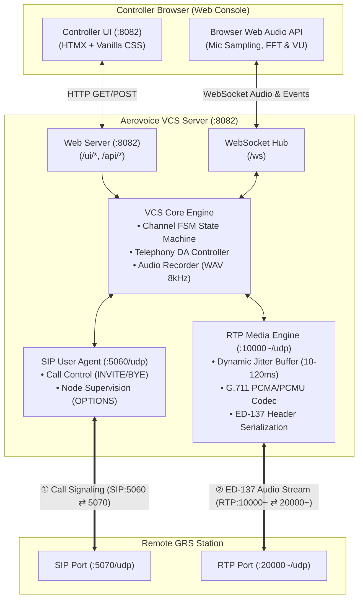
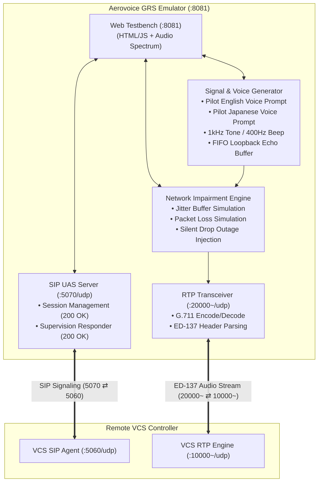
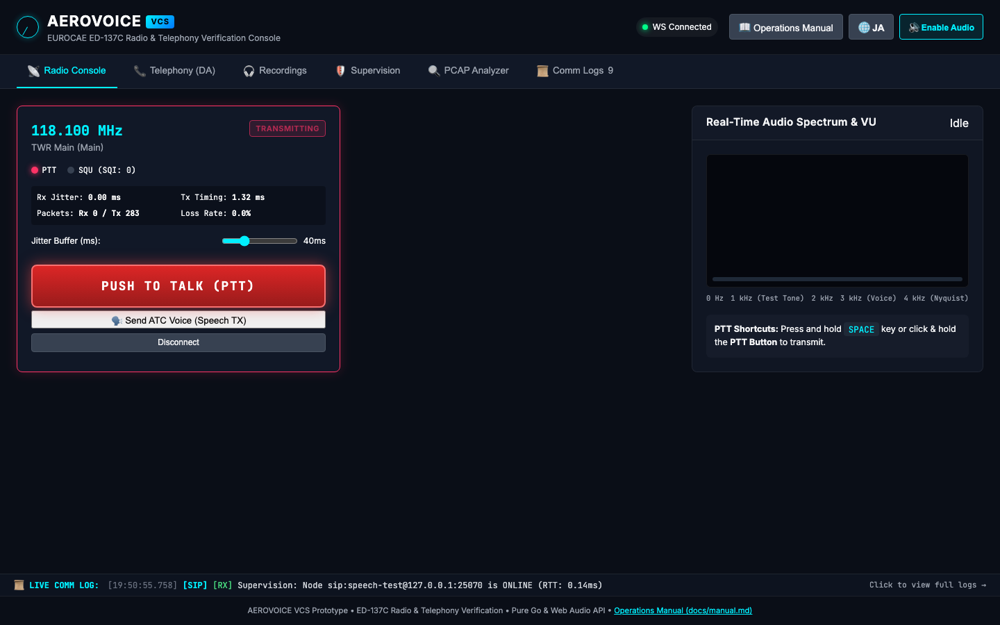
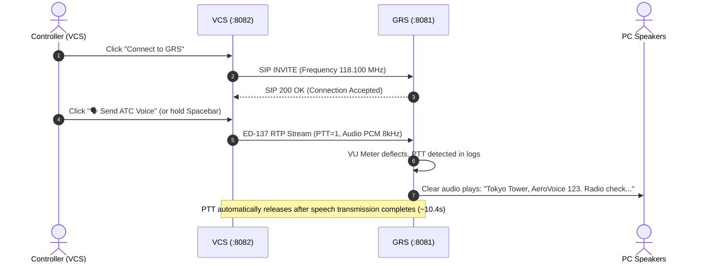

# Aerovoice Operations & Verification Manual

[English](manual.md) | [日本語](manual.ja.md)

This manual provides comprehensive instructions, operational workflows, topology diagrams, and verification scenarios for **Aerovoice**, an open-source Air Traffic Management (ATM) voice communication verification suite implementing the **EUROCAE ED-137C** standard.

---

## 1. System Overview & Connection Topology

Aerovoice consists of two independent Pure Go processes communicating via UDP over standard aviation VoIP protocols (SIP/SDP and RTP with ED-137 header extensions):
1. **VCS (Voice Communication System)**: The controller working position console.
2. **GRS (Ground Radio Station)**: The ground radio transceiver base station emulator.

### 1.1 VCS (Voice Communication System) Architecture

The controller console runs as an in-memory Pure Go server with an embedded, zero-npm HTMX interface:



### 1.2 GRS (Ground Radio Station) Architecture

The GRS emulator simulates ground radio transceiver towers deployed along airport runways:



### 1.3 Port Assignment & Protocol Reference Table

| Component | Default Port | Protocol | Purpose / Specification |
| :--- | :--- | :--- | :--- |
| **VCS Web Console** | `8082/tcp` | HTTP / WebSocket | Controller console UI, HTMX partials, Web Audio API stream |
| **VCS SIP Agent** | `5060/udp` | SIP (RFC 3261) | Radio call establishment, DA dialing, Supervision keepalive ping |
| **VCS RTP Engine** | `10000~/udp` | RTP / ED-137 | G.711 μ-law audio transmission and reception with profile `0x0167` |
| **GRS Web Testbench** | `8081/tcp` | HTTP | Ground radio testbench UI, impairment sliders, audio generators |
| **GRS SIP UAS** | `5070/udp` | SIP (RFC 3261) | Ground radio SIP answering endpoint and options ping responder |
| **GRS RTP Transceiver** | `20000~/udp` | RTP / ED-137 | Radio downlink transmission, uplink reception, loopback echo |

---

## 2. Getting Started (Interactive Dual-Screen Verification)

### 2.1 Starting the Services

Open two terminal windows:

```bash
# Terminal 1: Start Ground Radio Station (GRS) Emulator
make grs-run

# Terminal 2: Start Voice Communication System (VCS) Console
make vcs-run
```

*(Alternatively, run `make demo` to automatically spawn both consoles).*

### 2.2 Dual-Screen Window Layout

Position two browser windows side by side:
- **Left Window (VCS Console)**: [http://127.0.0.1:8082](http://127.0.0.1:8082)
- **Right Window (GRS Testbench)**: [http://127.0.0.1:8081](http://127.0.0.1:8081)



### 2.3 Audio Enablement & Browser Autoplay Policy

Modern browsers restrict automated audio playback until user interaction:
1. Click the **"🔊 Enable Audio"** button in the top-right corner of the VCS console.
2. The button highlights cyan, initializing the Web Audio `AudioContext` and preparing the FFT spectrum analyzer.
3. Clicking the button again immediately mutes and suspends the audio engine, stopping any audio leaks.

---

## 3. Step-by-Step Verification Scenarios

### Scenario 1: Radio Transmission (Controller PTT TX)

Verifies air-ground radio transmission from the controller to the aircraft.



1. In the **Left Window (VCS)**, locate the `118.100 MHz TWR Main` card and click **"📡 Connect to GRS"**.
   - The status badge turns green (`connected`).
2. Click the **"🗣️ Send ATC Voice (Speech TX)"** button.
   - The button switches to `🗣️ Speaking (ATC Voice)...` and the **PTT lamp (red)** illuminates.
   - In the **Right Window (GRS)**, the PTT indicator lights up, the VU meter deflects, and clear English radio check speech is heard.
   - Once transmission concludes (~10.4 seconds), the PTT key automatically releases.
3. Holding the **"PUSH TO TALK (PTT)"** button or **Spacebar** also initiates transmission.

---

### Scenario 2: Radio Reception (Aircraft Downlink SQU & FFT Spectrum)

Verifies downlink reception of aircraft transmission initiated by pilot radio.

1. In the **Right Window (GRS)**, ensure the audio source is set to **"🧑‍✈️ Pilot Voice (EN: Radio check...)"** (default).
2. Toggle the **"Squelch (SQU) Control"** switch to **ON (Transmitting)**.
3. Observe the **Left Window (VCS)**:
   - The **SQU lamp (green)** illuminates and signal quality index displays `SQI: 100`.
   - Clear pilot radio speech plays through your speakers.
   - The **Real-Time Audio Spectrum (Canvas)** renders sharp acoustic peaks and formant lines at 60 FPS.
   - Move the **"Jitter Buffer" slider** between `10ms` and `120ms` to dynamically adjust playout buffer depth.
4. In GRS, toggle SQUELCH back to **OFF** to close the receiver.

#### 🔁 Advanced Verification: GRS Loopback Echo
1. In GRS, select **"🔁 Loopback Echo (VCS Audio)"** under Audio Signal Generator and switch **Squelch to ON**.
2. In VCS, transmit speech using **"🗣️ Send ATC Voice"** or PTT.
3. The internal FIFO queue in GRS captures the audio and echoes it back in real time to the VCS speaker without stuttering.

---

### Scenario 3: Ground-to-Ground Telephony (Direct Access Intercom)

Verifies full-duplex telephone communications between air traffic control facilities.

1. In the VCS console, open the **"Telephony (DA)"** tab.
2. Click the **"Human Speech Test Call"** button.
3. An ED-137 SIP dialog establishes immediately:
   - The telephone panel displays active call state with remote URI `sip:speech-test@127.0.0.1:5070`.
   - Automated speech plays through the telephone channel.
   - The **RTT latency** and **packet jitter** meters update continuously.
4. Click **"Hang Up"** to terminate the call.

---

### Scenario 4: Dynamic Jitter Buffering & Network Impairment Injection

Verifies system resilience against IP network degradation (jitter and packet loss).

1. In the **Right Window (GRS)**, locate the **"⚡ Network Impairment Injection"** card.
2. Drag the **"Injected Jitter" slider** to `30ms` and **"Injected Loss" slider** to `10%`.
3. In VCS, observe the real-time stream statistics card in the Radio Console:
   - `Jitter` metric reflects the injected network variations.
   - The dynamic jitter buffer adjusts its FIFO playout threshold to maintain clean, glitch-free audio reproduction.

---

### Scenario 5: Legal Audio Recording & In-Browser Playback (ED-137 Volume 4)

Verifies automated legal recording of aeronautical communications.

1. Open the **"Recordings"** tab in the VCS console.
2. A complete catalog of all recorded PTT, SQU, and telephone sessions is displayed.
3. Each entry lists timestamp, duration, channel ID, and audio format (8 kHz 16-bit Linear PCM).
4. Click the **"▶ Play"** button on any record to listen immediately within the browser, or click **"⬇ Download WAV"** to export the uncompressed audio file.

---

### Scenario 6: Node Supervision & Keepalive Monitoring (ED-137 Volume 5)

Verifies continuous health checks of remote radio equipment.

1. Open the **"Supervision"** tab in the VCS console.
2. Cards display real-time SIP status, total OPTIONS keepalive count, and round-trip latency (RTT in ms).
3. **Simulating Outage**: In GRS under **"Supervision & Fault Simulation"**, toggle **"Silent Drop (Simulate GRS Offline)"** to **ON**.
4. In VCS, observe the supervision indicator detect unanswered OPTIONS pings and transition the node to `OFFLINE / UNREACHABLE`.

---

### Scenario 7: Post-Incident PCAP Inspection & Audio Recovery

Verifies forensic investigation of recorded network traffic.

1. Open the **"PCAP Analyzer"** tab in the VCS console.
2. Drag and drop any `.pcap` capture file into the upload zone.
3. The built-in analyzer parses SIP dialogs and ED-137 RTP packets, rendering a packet timeline with PTT, SQU, and SQI flags.
4. If G.711 payloads are present, click **"▶ Play Restored Audio"** to reconstruct and audition the exact audio exchanged over the air.

---

## 4. UI Reference Guide

### 4.1 VCS Console Tabs

| Tab Name | Main Controls & Visual Elements | Purpose |
| :--- | :--- | :--- |
| **Radio Console** | Frequency cards, PTT/SQU lamps, PTT button, ATC voice trigger, Jitter slider, 60 FPS Canvas FFT spectrum | Operational radio monitoring, transmitting, and receiving |
| **Telephony (DA)** | Direct Access buttons, speed dial keypad, active call card, speech and tone test triggers | Ground-to-ground intercom and telephone communication |
| **Recordings** | Audio recording catalog, duration, inline player, WAV download links | Audit and retrieval of legally compliant communication logs |
| **Supervision** | SIP node health cards, RTT latency meters, alive/dead indicators | Real-time monitoring of ground radio station network availability |
| **PCAP Analyzer** | Drag & drop capture upload zone, decoded packet timeline, audio reconstructor | Forensic analysis of network captures without external tools |
| **Comm Logs** | Terminal log viewer, protocol tags (SIP, ED-137), search filter, live ticker | Deep inspection of signaling transactions and media events |

### 4.2 GRS Testbench Tabs

| Tab Name | Main Controls & Visual Elements | Purpose |
| :--- | :--- | :--- |
| **Radio Transceiver** | Squelch (SQU) toggle, audio source radios (Pilot EN/JA, Telephony EN/JA, Tone, Echo), impairment sliders | Ground base station transmission and fault simulation |
| **Telephony Test** | Direct call trigger to VCS position 101, auto-answer mode configuration | Simulating inbound calls from external ATC centers |
| **Supervision & Faults** | Silent drop toggle, OPTIONS ping counters | Testing VCS fault detection and failover alerting |
| **Protocol Logs** | Real-time GRS event log terminal, clear logs button | Inspecting ground radio state transitions and RTP packet reception |

---

## 5. Troubleshooting & FAQ

### Q1: I don't hear any audio from my PC speakers.
- Check the top-right corner of the VCS console. If the button displays **"🔊 Enable Audio"**, click it to unmute. Modern browsers prevent audio playback until explicitly initiated by user interaction.
- Ensure your OS sound output volume is not muted.

### Q2: Windows Defender Firewall shows a warning on first launch.
- Allow communication on **"Private Networks"**. Aerovoice requires local UDP communication on ports 5060, 5070, 10000, and 20000.

### Q3: How do I switch languages?
- Click the **"🌐 EN"** / **"🌐 JA"** button in the VCS header. The interface, help modals, and documentation links immediately switch to the selected language.

---

## 6. Multi-Tier E2E Test Suite & Continuous Integration

To run the automated verification suite:

```bash
# Run unit & coverage test
make test

# Run ED-137 protocol verification suite
make aerovoice-test

# Run Headless Chrome visual E2E test suite (generates bilingual HTML reports)
make vcs-frontend-e2e
```

All test reports and snapshots are deployed to [GitHub Pages](https://sh0jitmy.github.io/aerovoice/).
